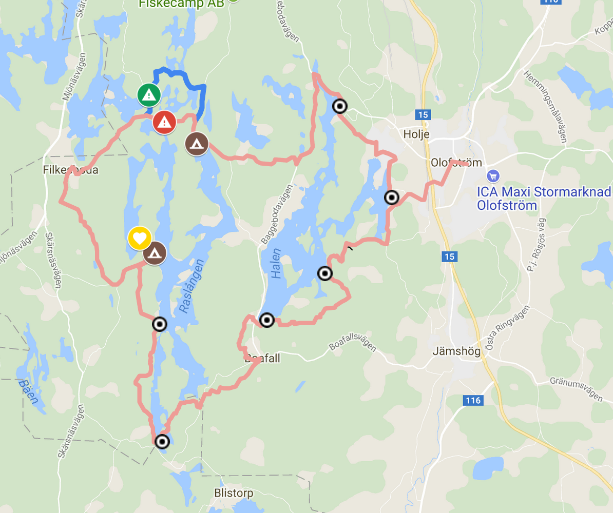
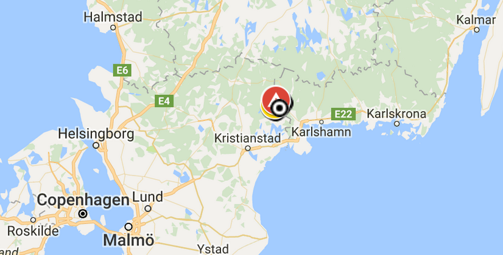
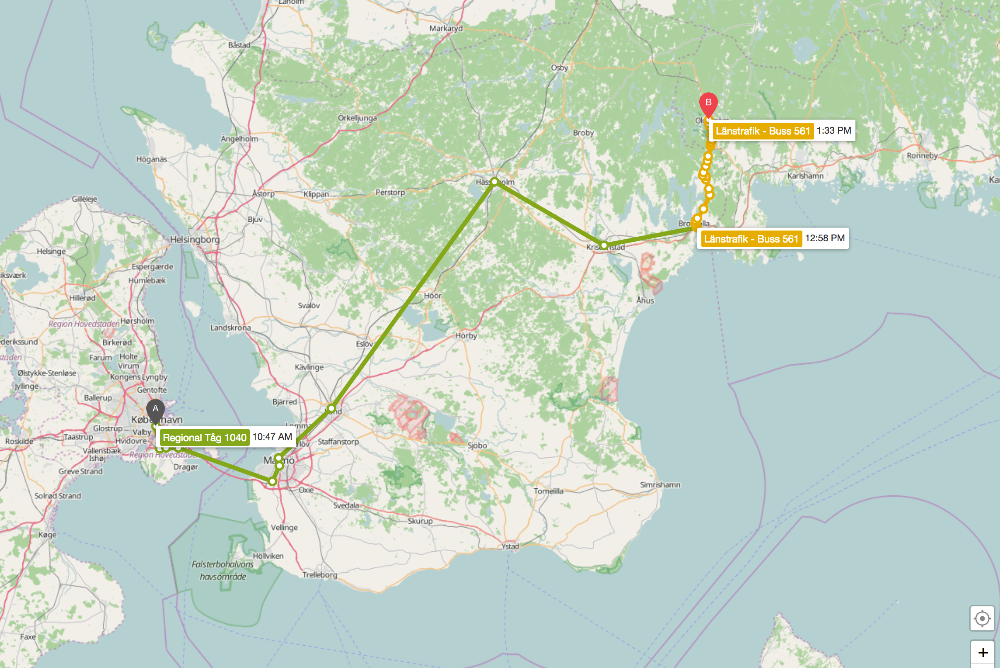
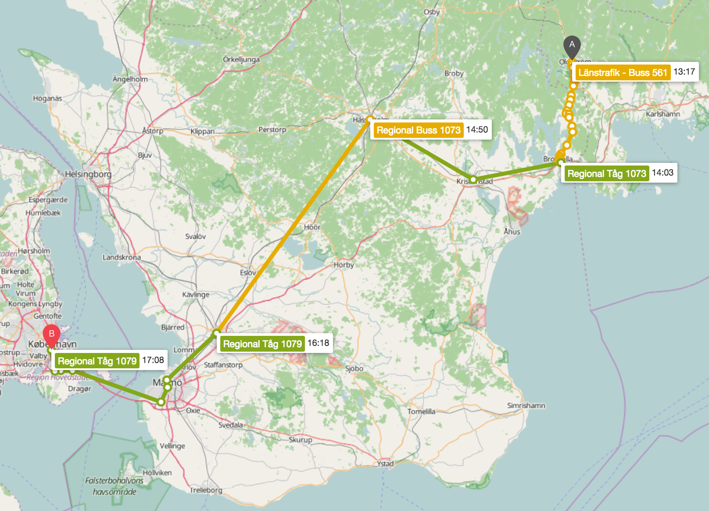
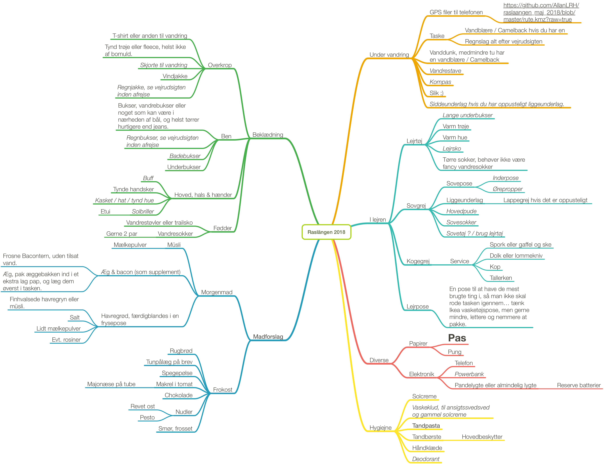

# Forårsvandretur ved Raslängen

## Lidt om ruten

Den 42 km lange vandrerute er beskrevet på [sydsveriege.dk](http://www.sydsverige.dk/?pageID=167), og et stort google-kort over ruten kan ses [her](https://www.google.com/maps/d/viewer?mid=1SCh1L7ji6r9y0MX-nO0k02qFpYw&ll=56.27263379087586%2C14.529554075694477&z=15). Data fra kortet kan downloades til ens telefon [her](./rute.kmz), eller med linket fra google-kortet.

Turen begynder i Olofström, og går vestpå, og derfra rundt om søen Raslängen, for igen at ende i Olofström:

Olofström ligger en anelse mere nordligt end Helsingør, og meget nærmere den svenske østkyst end vestkyst, så vi skal ud på en betragtelig togtur… landskabet skulle dog være det hele værd!

## Praktisk om rejsen

### Udrejse

Vi mødes på Københavns hovedbanegård _fredag d. 11. maj klokken 10:15 under uret_, hvor vi køben biletter — **husk pas eller kørekort**  — og tager _Öresundståg Regional, Tåg 1040_ klokken 10:47.

Rejsetiden er knap 3 timer, og på sj.se (Svenske Jernbaners hjemmeside) står biletten for en voksen i skrivende stund til 250–280 sek.

Hent evt. vores rejseplan [her](https://github.com/AllanLRH/raslaangen_maj_2018/raw/master/rejseplan_udrejse.pdf).

### Hjemrejse

Vi sigter efter at være på Københavns hovedbanegård igen søndag kl. 17:08, hvilket betyder at vi skal slå lejr tæt på busstoppet som fører os hjem, eller stå tidligt op søndag.

Hjemrejsen tager ca. 4 timer.
Vi køber biletten i Sverige, hvor man plejer at kunne betale med Visa.

Hent evt. vores rejseplan [her](https://github.com/AllanLRH/raslaangen_maj_2018/raw/master/rejseplan_hjemrejse.pdf).

## Praktisk på turen

Vi satser på at sove i shelters, men tager også noget telt eller pressening med, for det tilfælde skyld at der er optaget i shelterne.
Vi prøver at have nogle ting fælles, så vi ikke skal bære på mere end nødvendigt.

### Mad

Husk at det kan være rart at købe ind nogle stykker sammen.

Da vi har fælles aftensmad, vil madtjanserne blive delt ud mellem deltagerne.

* Vi har brændere og gryder med på turen, som man selvfølgelig kan låne hvis man har brug for det
* Vi har fælles aftensmad, og står selv for frokost og morgenmad, men skal man spise fx havregrød om morgenen, er det oplagt at deles om en stor gryde, og mindske opvasken ;)
* Jeg foreslår smørrebrød til frokost, for så er det jo oplagt at dele pålæg på kryds og tværs. Føtes og Kvickly plejer at have noget mere spændende vandreegnet pålæg.

### Fællesgrej

Du skal have plads til noget af fællesgrejet i din rygsæk. Fællesgrejet inkluderer:

* Fællesmad
* Brænder, gryder og brændstof
* Telt(e) eller pressening, alt afhænig af vejrudsigten. Sheltersne kan nemlig være optagede.
* Opvaskesæt
* Stor, sammenfoldelig vanddunk til brug i lejren
* Myggemiddel
* Pulverkaffe og the
* Salt og peber
* Køkkenrulle
* Shitkit: Toiletskovl, toiletpapir & alcohol-gel
* Førstehjælpssæt
* Evt. foldesav samt økse eller en stor kniv til brænde
* Evt. bålgryde og grydeske
* Evt. aeropress og kaffe
* Evt. skærebræt

### Personligt udstyr

Her er en pakkeliste til inspiration, klik på billedet for at hente den som PDF, eller [her](./raslaangen_2018_deltager.txt) for at se den som tekst.

Når noget står med krusiv indikerer det, at det er en foreslået genstand, frem for en nødvendig genstand.

