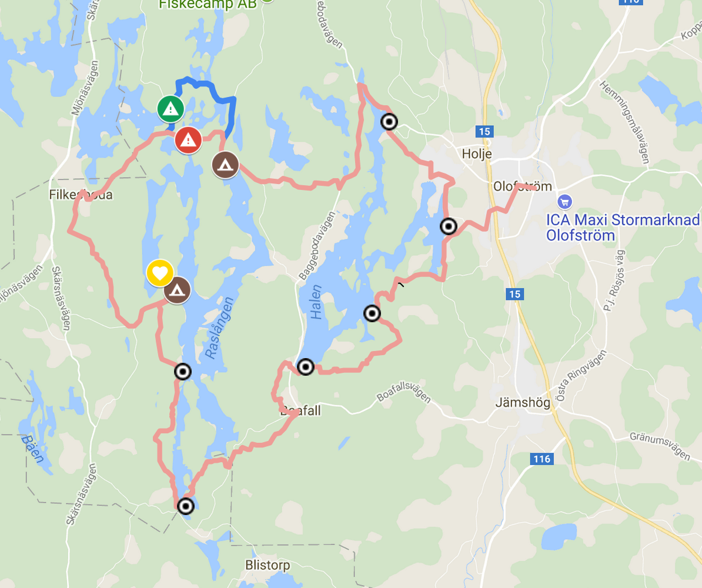

# Forårsvandretur ved Raslängen

## Lidt om ruten

Den 42 km lange vandrerute er beskrevet på [sydsveriege.dk](http://www.sydsverige.dk/?pageID=167), og et stort google-kort over ruten kan ses [her](https://www.google.com/maps/d/viewer?mid=1SCh1L7ji6r9y0MX-nO0k02qFpYw&ll=56.27263379087586%2C14.529554075694477&z=15). Data fra kortet kan downloades til ens telefon [her](./rute.kmz), eller med linket fra google-kortet.

Turen begynder i Olofström, og går vestpå, og derfra rundt om søen Raslängen, for igen at ende i Olofström:

Olofström ligger en anelse mere nordligt end Helsingør, og meget nærmere den svenske østkyst end vestkyst, så vi skal ud på en betragtelig togtur… landskabet skulle dog være det hele værd!

## Praktisk om rejsen

### Udrejse

Vi mødes på Københavns hovedbanegård _fredag d. 11. maj klokken 10:15 under uret_, hvor vi køben biletter — **husk pas eller kørekort**  — og tager _Öresundståg Regional, Tåg 1040_ klokken 10:47.

Rejsetiden er knap 3 timer, og på sj.se (Svenske Jernbaners hjemmeside) står biletten for en voksen i skrivende stund til 250–280 sek.

Hent evt. vores rejseplan [her](./rejseplan_udrejse.pdf).

### Hjemrejse

Vi sigter efter at være på Københavns hovedbanegård igen søndag kl. 17:08.

Hent evt. vores rejseplan [her](./rejseplan_hjemrejse.pdf).

